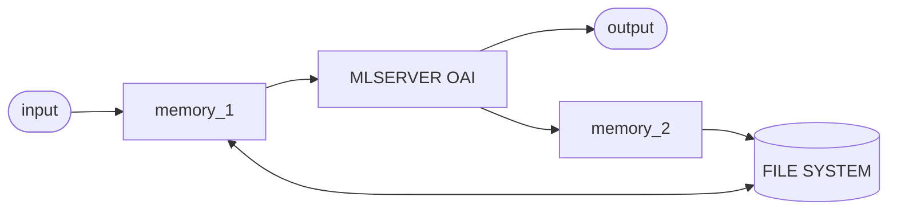

# Hands on Workshop Building a Chat App With Memory using Seldon

This demo implements a seldon-core-v2 pipeline with integrated state using the memory rt and a choice of two LLM backends: the OpenAI RT or the LocalLLM RT. This is a demo of the following seldon products:

1. MLserver memory runtime
2. MLserver openai runtime
3. MLserver local runtime


## Being Deplyed today:
    - Two memory components
    - A local chat RT component
    - A chat pipeline app use the LocalLLM RT

In order to run a terminal interface with the app use:

```sh
python chat.py --target=<target> --memory_id=<memory-id>
```

where memory-id is the id of a converstation and is optional (Not sepcifying will result in a new memory_id and converstation). And target is one of local or openai and specifies which RT to talk to.


To remove use:

```
make undeploy
```

## SCV2 flow

### Chat App Flow

The chat app pipeline looks like:




## Uploading and Deploying models

Currently the models are in a public google bucket and you should be able to deploy them without changing anything. However, if not, you can create your own google bucket and edit the `upload_models.py` and `deployment/models.yaml` files to reflect these changes. Note `python upload_models.py` contains a script to upload models to my google bucket. Similarly the makefile command: `make upload` will upload the models.