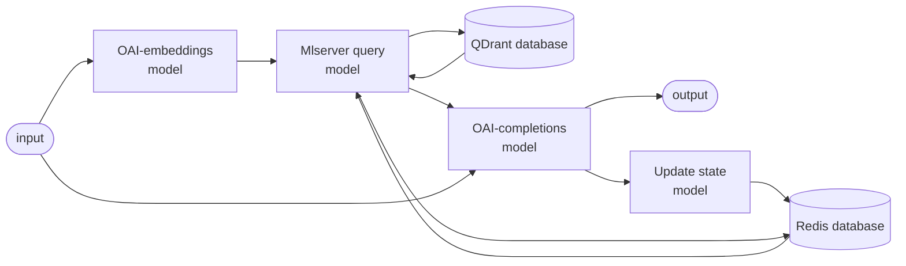

# Statelful (REDIS) RAG app

The Stateful RAG (retrieval augmented generation) demo allows users to query the seldon core v2 docs and do so in a conversational format.

## setup

### Firstly:

1. Make sure you have: 
    - A KIND or KLAW cluster with seldon-core-v2 isntalled
    - Your kubectl context correctly pointing at the cluster
    - The llm runtimes servers running
    - A redis deployment
    - A qdrant deployment

    If you are missing any of these see the [setup README](../../setup/README.md).
2. Create and activate demos [virtual environment](../README.md)

### Secondly:

We need to scrape the seldon-core-v2 docs, chunk and vectorise them and then insert them in the vector database. To do this:

1. Run [scrape.ipynb](./scrape.ipynb)
2. Get the `gcloud-application-credentials.artifact-registry.json` file from Alex Athorne. Note this file should go in the `./setup` folder
2. `make create-secret`
3. `make create-jobs`

### Finally:

In order to run the demo use:

1. Run `make deploy`
2. `python frontend.py`

In order to undeploy the app you can run:

```
make undeploy
```

## SCV2 flow

The demo works by first embedding the users query into a vector using the openai embeddings mlserver runtime. This is used to query the vector database for similar text chunks within the documentation. These chunks are appended to a history of the conversation (obtained from the redis store) as well as the original user query. All of these are sent to the openai completions mlserver runtime which uses the documentation context and history to answer the users questions.

### Stateful RAG demo flow




## Uploading and Deploying models

Currently the models are in a public google bucket and you should be able to deploy them without changing anything. However, if not, you can create your own google bucket and the `upload_models.py` and `deployment/models.yaml` files to reflect these changes. Doing so means that running `python upload_models.py` will upload the models to the google bucket. Similarly the makefile command: `make upload_deploy` will upload and then deploy the models. Note the qdrant mlserver runtime requires [qdrant-client](https://github.com/qdrant/qdrant-client) which will have to be packaged into the mlserver runtime. To do this you can run `make pack`.
